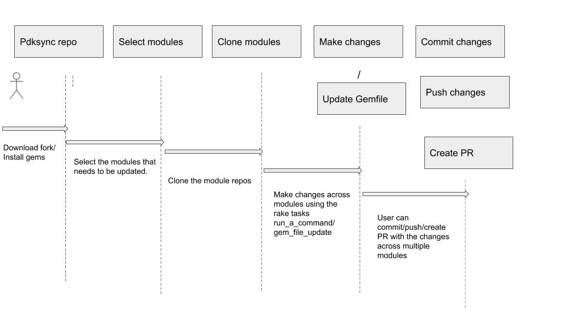

## PDKSYNC

### Introduction

Pdksync is an efficient way to run a pdk update command against the various Puppet module repositories that you manage — keeping them up-to-date with the changes made to PDK. 
The tool checks out a module, runs the most recent version of pdk update then proceeds to create the PR for you with the changes. 
This is the automated tool for ensuring modules can quickly adopt changes introduced by updates to the PDK and PDK template. 

Pdksync by default expects that your Puppet module repositories live on GitHub and will behave accordingly. It also supports GitLab as an alternative Git hosting platform. 

### Step-by-step guide

Running the tool itself is quite simple and can be called from a rake task.

- Download a fork of the repo, which can be found [here][https://github.com/puppetlabs/pdksync]. 
Or you can install via Rubygems, it can be found [here][https://rubygems.org/gems/pdksync]. 
- Install gems by using `bundle install`. 
- Ensure you have a GITHUB_TOKEN or GITLAB_TOKEN set in your env, if you don't add it by running `export GITHUB_TOKEN=<your github token>` or `export GITLAB_TOKEN=<access_token>` , this is required for authentication. 
- Important - Manually edit the list contained in 'managed_modules.yml' to ensure it is correct with the modules you wish to update. 
Please note this is critical as this tool will create PRs against the repos included in this list - you don't want to run this against a module you aren't familiar with. 
Do not proceed to the next step without doing this. 
- Run the rake task by using `bundle exec rake pdksync`. 



### Using pdksync for mass updates

`bundle exec rake git:clone_managed_modules`

`bundle exec rake 'pdksync:run_a_command[touch dog]'`

`bundle exec rake 'git:create_commit[removeboltgem, (maint) Remove bolt gem from sync.yaml file]'`

`bundle exec rake 'git:push_and_create_pr[(MODULES-xxxx) Remove bolt gem from the modules]'`

### Using scripts with pdksync

Sometimes you will want to make many changes in each module. Below is a simple bash script to execute 3 commands in each module

`bundle exec rake 'pdksync:run_a_command[cp ../../yamlbthere.rb .]'`
`bundle exec rake 'pdksync:run_a_command[ruby yamlbthere.rb Gemfile]'`
`bundle exec rake 'pdksync:run_a_command[rm -f yamlbthere.rb]'`

Executing ruby scripts is even more powerful. 

Imagine the script below running against every module. 

```
require 'yaml'
require 'pry'
gems_to_remove = ["      - gem: beaker.*version: '~> 3.13'.*from_env: BEAKER_VERSION.",
                  "      - gem: beaker-abs.*version: '~> 0.1'.*from_env: BEAKER_ABS_VERSION.",
                  "      - gem: beaker-abs.*from_env: BEAKER_ABS_VERSION.*version: '~> 0.1'.",
                  '      - gem: beaker-pe.',
                  "      - gem: beaker-hostgenerator.*version: '>= 0.0'.*from_env: BEAKER_HOSTGENERATOR_VERSION.",
                  '      - gem: beaker-hostgenerator.*from_env: BEAKER_HOSTGENERATOR_VERSION.',
                  "      - gem: beaker-rspec.*version: '>= 0.0'.*from_env: BEAKER_RSPEC_VERSION.",
                  '      - gem: beaker-rspec.*from_env: BEAKER_RSPEC_VERSION.']

file = File.open('.sync.yml')
contents = file.readlines.join
gems_to_remove.each do |regex|
  contents = contents.gsub(%r{#{regex}}m, '')
end
File.open('.sync.yml', 'w') { |f| f.write contents.to_s }`
```

### Releasing PDKSync

PDKSync is a Gem the IAC team maintains, therefore the IAC team is currently responsible for releasing PDKSync as it goes through updates.

The following steps should be followed for this process to go smooth:

- Check the repo out locally and install your gems using bundler.
- Check out a new branch.
- Set your Changelog environment variable like so:
`export GITHUB_TOKEN=*YOUR KEY HERE*`
- Update the 'future_release' property in the Rakefile to the next release version, [like so][https://github.com/puppetlabs/pdksync/pull/80/files#diff-52c976fc38ed2b4e3b1192f8a8e24cff]. Do the same with the version in the [gemspec][https://github.com/puppetlabs/pdksync/pull/80/files#diff-03cf58fcfb54553e44c06aecc5886429ae05dba24144b2c10e1cc8111ba1ba1fL6].
- Run the Changelog generator rake task:
`bundle exec rake changelog`
- Add all the files and push your work. *NOTE* Push your branch to upstream, travis requires this to be able to authenticate to run tests. The command should be similar to:
`git push upstream myreleaseprep`
- Open your PR as normal, it should look very similar to this: https://github.com/puppetlabs/pdksync/pull/80/files
- Get your PR merged after it goes green.
- Build your Gem:
`gem build <gemspec>`
`bundle exec gem build pdksync.gemspec`
- Publish your gem (You'll need to make sure you have a ruby gems account)
`gem push <.gem file>`
`bundle exec gem push pdksyncs-0.5.0.gem`
- Tag the Release and push it upstream
`git tag -a -m "0.5.0" 0.5.0 0abbc85e409ce3065bf073387a31adfba38b1bb2`
`git push upstream --tags`

Sit back and relax, you've released PDKSync!

### References

https://github.com/puppetlabs/pdksync 

https://github.com/puppetlabs/iac/blob/main/_posts/2020-02-12-gem-testing-with-pdksync.md 

https://github.com/puppetlabs/iac/blob/main/_docs/demos.md 
